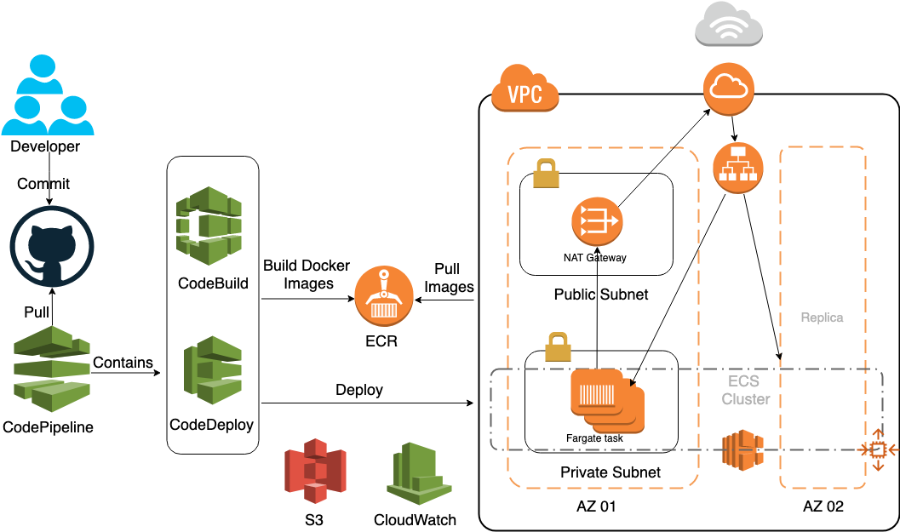

# Cloud Decipher: Auto-scalable and high-abailability infrastruscture for a ML app (Decipher) with CI/CD pipeline
## Project Purpose
The AI team of engineers have built a machine learning application (Decipher) that interprets poorly written word(s) into machine readable text. For more information, please check out [Decipher](https://github.com/mevanoff24/HandwritingDetection) (By Matt Evanoff). The project aims to use simple commands to provision a auto-scalable and high-availability infrastructure for the Dockerized application with CI/CD pipeline.

## Design Details
### The ML APP
The app **Decipher** demo can be found [here](https://www.youtube.com/watch?v=9HbJAJtsU7Y&feature=youtu.be).
### System Infrastructure

### Hightlights
* Easy provisioning of infrastructure with Terraform
* Highly available (multi-availability zone) design
* Auto-scalable (scale-out and scale-in) ECS cluster 
* Centralized logging using CloudWatch
* Continuous deployment via CodePipeline with zero downtime: ML models can be updated easily

## Requirements
* Terraform [More Info](https://learn.hashicorp.com/terraform/getting-started/install.html)  
* AWS-IAM   [More Info](https://docs.aws.amazon.com/eks/latest/userguide/install-aws-iam-authenticator.html)   
* AWS Credential: Export AWS_ACCESS_KEY_ID and AWS_SECRET_ACCESS_KEY to Host Environment

## Instructions
### DevOps 
In order to have access to the application reporisitory for CodePipeline, please generate the GitHub token follow the instructions [here](https://help.github.com/articles/creating-a-personal-access-token-for-the-command-line/).  
```$ export GITHUB_TOKEN=YOUR_TOKEN```  
  
The infrastructure can be easily spun up by the following commands in the `terraform` directory:
 
```bash
terraform init
terraform apply
```

The the ALB DNS will be shown after `Terraform Apply` complete. Visit your website using your ALB DNS! Your personal DNS can be set up easily using [route53](https://docs.aws.amazon.com/Route53/latest/DeveloperGuide/registrar.html). 
To destroy the infrastructure:
```bash
terraform destroy
```

### For other dockerized models
Replace the github repo information in the `modules/Pipeline` directory.   
Configure the container ports according to your app configuration in the `modules/ecs` directory.  
Follow the previous steps to try it out!
    


